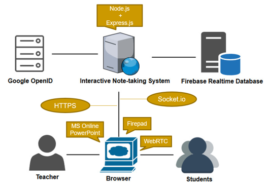
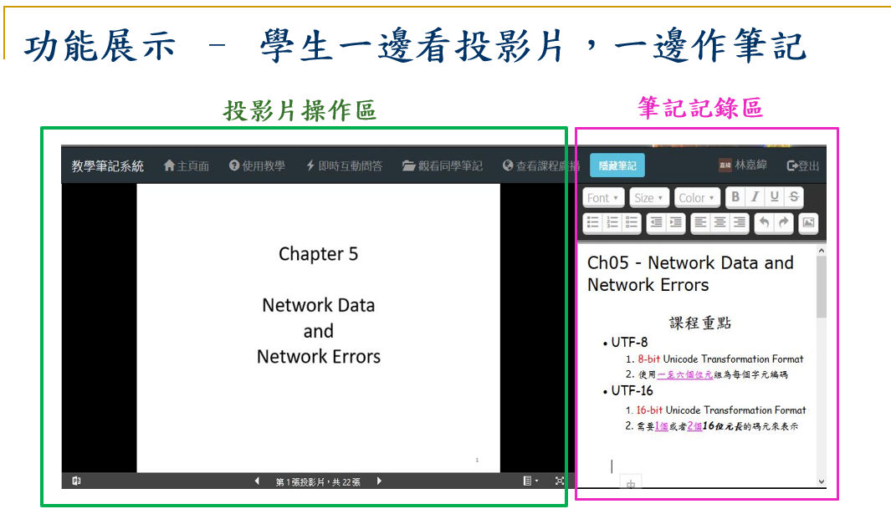
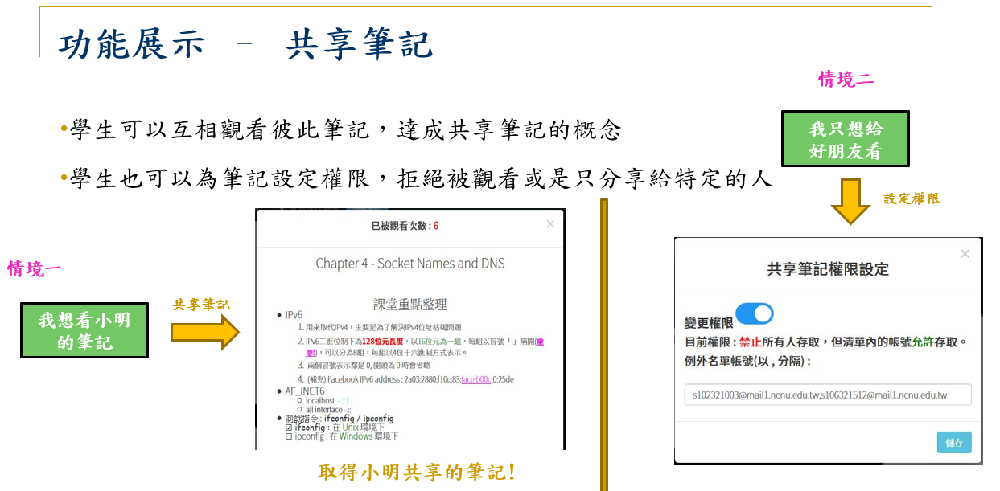
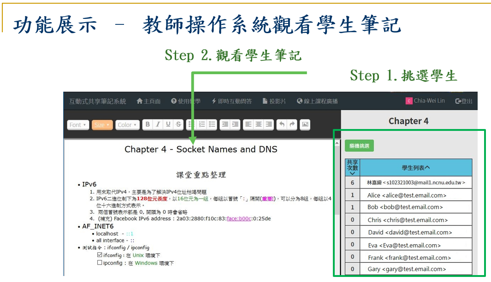
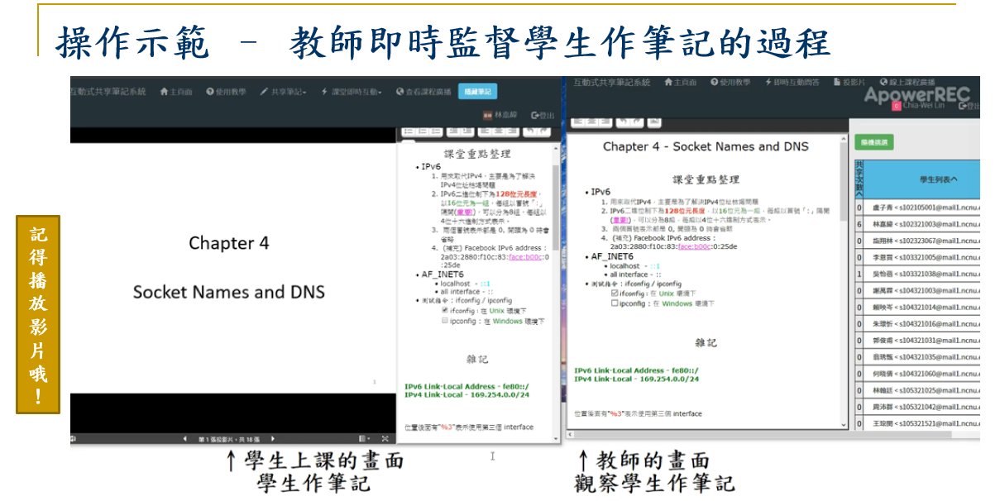
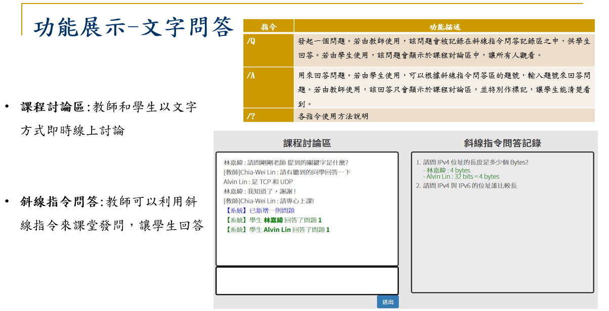
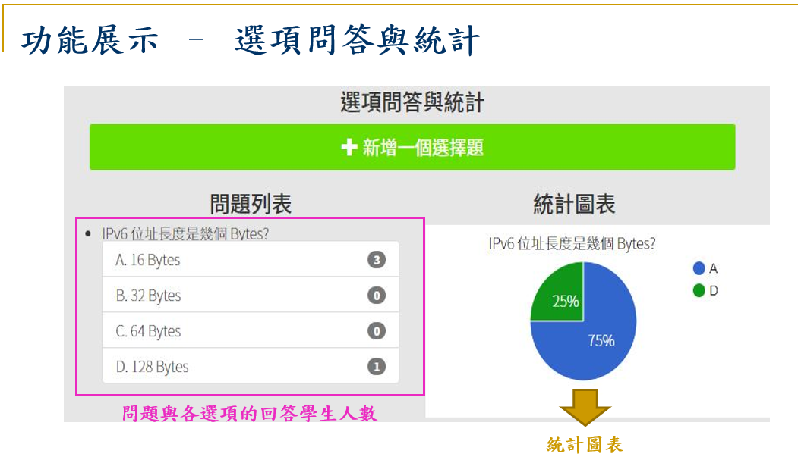
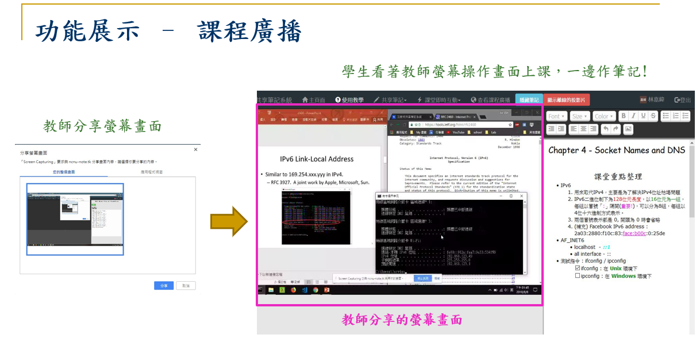

Note-taking system ( Final version )
======================================

Thesis title : An Interactive Online Note-taking System to Facilitate Teaching and Learning in Higher Education

中文論文名稱 : 輔助大學課堂教學之互動式線上共享筆記系統

Introduction
------------------

Nowadays, a lot of collaborative note-taking software tools can be found on the Internet, so many students take their notes with classmates by these tools. However, students often find it difficult to share or organize their notes with others when they are utilizing different tools. Even if all students use the same collaborative note-taking software to edit a document concurrently, usually one student must be designated as the main writer and other students only provide supplementary notes which the main writer does not write down. However, in this scenario, only one student is actively taking notes, while others are less involved.  Therefore, retention of learning might be reduced. Meanwhile, if we consider presentation slides as a powerful tool which many teachers use to assist their teaching in class, current collaborative note-taking software did not provide a natural mechanism to incorporate slides. That is, current collaborative note-taking software could not support teaching and learning efficiently.

This thesis proposes an interactive online note-taking system to facilitate teaching and learning in higher education. It comprises four elements in classroom teaching including teacher, student, slide, note-taking. It also supports interaction, note sharing, and live broadcasting. Students can “share” notes instead of “collaborating” on notes. With this system, teachers can monitor students’ learning status by their notes. Furthermore, in this system students and teachers can interact with each other by questions and answers. These features will help students and teachers to facilitate teaching and learning.

System Architecture
-----------------------

Demo
------

Install Preparation
----------------------

1. Ubuntu 16.04

2. Node.js >= v8.11.2

3. [Google OAuth API](https://developers.google.com/identity/protocols/OAuth2)
	
> (1). Create a new project.
> 
> (2). In project page, create **OAuth Client ID** credentials.
> 
> (3). Add `http://localhost:8080` or `https://<your_doamin>` in  **Authorized JavaScript origins**.
> 
> (4). Add `http://localhost:8080/auth/google/callback` or `https://<your_domain>/auth/google/callback` in **Authorized redirect URIs**.

4. [Firebase Realtime Database](https://firebase.google.com/docs/web/setup?authuser=0)
	
> (1). Create a new project.
> 
> (2). In project page, click **Add Firebase to your web app**.
> 
> (3). Copy project's customized code snippet and save. More details will be told in **Build** chapter. This is the sample of customized code you have to copy : 
    
    var config = {
         apiKey: "your_api_key",
         authDomain: "note-taking-system-final.firebaseapp.com",
         databaseURL: "https://note-taking-system-final.firebaseio.com",
         projectId: "note-taking-system-final",
         storageBucket: "note-taking-system-final.appspot.com",
         messagingSenderId: "your_id"
      };
    firebase.initializeApp(config);

> (4). Choose **Database** => **Realtime Database** => **Rule**. Substitute the new content below for the old ones.
    	
        
        {
          "rules": {
            ".read": true,
            ".write": true,
            "users" : {
              ".indexOn": "email"
            },
          }
        }
        

Build
------------

1. Clone and install

        $ git clone https://github.com/alvin9453/NTS_Final.git 
        $ cd ./NTS_Final/
        $ npm install

2. Add a ``ssl`` folder in ``bin`` :

        $ cd bin
        $ mkdir ssl
        $ mv <certificate.crt> <private.key> ssl/

3. Edit ``bin/www``

   If you just build on localhost : 
        
        var isUseHTTPs = false;
        ....
        // var port = 443;  // comment this line
        var port = normalizePort(process.env.PORT || '8080');

   If you deploy this application in https domain : 

        var isUseHTTPs = true;
        ....
        var port = 443;
        // var port = normalizePort(process.env.PORT || '8080'); // comment this line

4. Edit ``callbackURL`` in ``config/auth.json``, if you just test in localhost , use this code : 

        "callbackURL" : "http://localhost:8080/auth/google/callback"

    Or change it with your website's domain : 

        "callbackURL" : "http://<your_domain>/auth/google/callback"

5. Copy Firebase customized code in `firebase-init.js` and `app.js`. You have to replace the old content to the new code that you copied.

6. Start this application : 

        $ npm start

Then open ``localhost:8080`` or ``https://<your_domain>`` in your browser.
